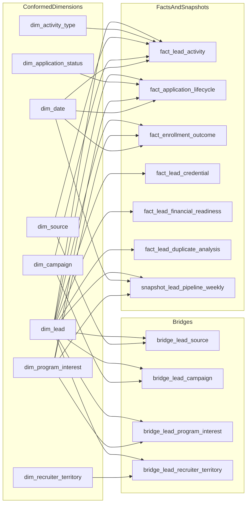

# Lead Acquisition Analytics Architecture Recommendation

## Objective

Design a business-ready dimensional model for university acquisition lifecycle reporting:

`Lead -> Application -> Admit -> Enroll`

Source metadata used: `sql/bronze_ddls.txt` (full BRONZE schema DDL extract).

---

## 1) Recommended Target Model (Clean Dimensional)

### Conformed Dimensions

- `dim_lead` (SCD2): canonical lead identity and conversion state
- `dim_source` (SCD1/SCD2): source/vendor/venue
- `dim_campaign` (SCD1/SCD2): campaign identity/type group
- `dim_activity_type` (Type-0): normalized activity classes
- `dim_program_interest` (SCD2): active program/term/cycle context
- `dim_recruiter_territory` (SCD2): ownership assignment context
- `dim_application_status` (Type-0/SCD1): normalized application/admit decision statuses
- `dim_date` (Type-0): reporting calendar and recruitment-cycle calendar

### Bridges

- `bridge_lead_source` (lead <-> source touches)
- `bridge_lead_campaign` (lead <-> campaign members)
- `bridge_lead_program_interest` (lead <-> program interests)
- `bridge_lead_recruiter_territory` (lead <-> recruiter/territory assignments)

### Facts / Snapshots

- `fact_lead_activity` (transaction fact, one row per activity event)
- `fact_application_lifecycle` (transaction fact, one row per application event/status change)
- `fact_enrollment_outcome` (transaction fact, one row per enrollment outcome event)
- `fact_lead_credential` (transaction fact)
- `fact_lead_financial_readiness` (transaction fact / ISIR)
- `fact_lead_duplicate_analysis` (analytical fact by run date)
- `snapshot_lead_pipeline_weekly` (periodic snapshot by lead-cycle-week)

---

## 2) Why this model

- Supports both acquisition analytics and downstream applicant/enrollment progression.
- Separates event facts from dimensions to avoid mixed grain.
- Preserves explainable lineage from BRONZE objects to KPI outputs.
- Allows phased rollout:
  - Phase-1: lead acquisition + readiness + ownership
  - Phase-2: complete application/admit/enroll outcomes

---

## 3) Lifecycle Diagram (Client-ready)

---

## 4) SCD and Fact Type Standards

- `dim_lead`: SCD2
- `dim_recruiter_territory`: SCD2
- `dim_program_interest`: SCD2
- `dim_source`, `dim_campaign`: SCD1 initially; upgrade to SCD2 if historical reclassification is required
- `dim_activity_type`, `dim_application_status`, `dim_date`: Type-0/SCD1
- `fact_*` tables: transactional or periodic snapshot according to declared grain

---

## 5) Raw coverage assessment from bronze

Available key raw objects in `bronze_ddls.txt` for lifecycle:

- Acquisition/engagement: `LEAD`, `SOURCE__C`, `CAMPAIGN`, `CAMPAIGNMEMBER`, `TASK`, `CDP_COMMUNICATION_RESULT__C`, `PROGRAMS_OF_INTEREST__C`, `WEEKLY_LEAD`
- Application/admit: `APPLICATION__C`, `APPLICATION_STATUS_HISTORY__C`, `APPLICATION_SUPPORTIVE_DOCUMENTS__C`, `ADMISSION_REQUIREMENT__C`
- Post-conversion context: `ACCOUNT`, `CONTACT` (contain applicant/admit/enroll-related fields)

Conclusion: full lifecycle model is feasible with current BRONZE coverage, with some KPIs marked conditional based on business-rule finalization.

